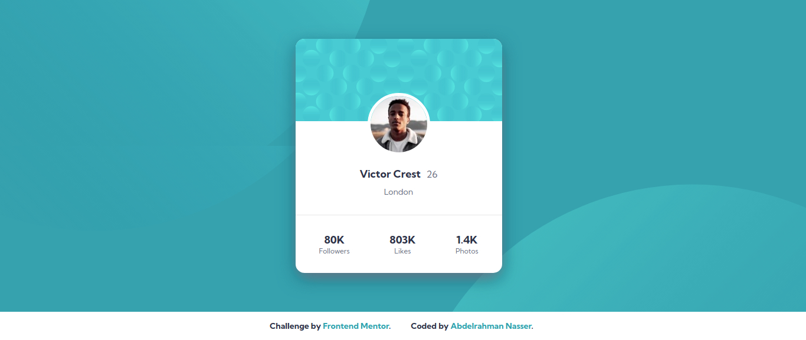

# Frontend Mentor - Profile card component solution

This is a solution to the [Profile card component challenge on Frontend Mentor](https://www.frontendmentor.io/challenges/profile-card-component-cfArpWshJ). Frontend Mentor challenges help you improve your coding skills by building realistic projects. 

## Table of contents

- [Overview](#overview)
  - [The challenge](#the-challenge)
  - [Screenshot](#screenshot)
  - [Links](#links)
- [My process](#my-process)
  - [Built with](#built-with)
  - [Continued development](#continued-development)
- [Author](#author)

## Overview

### The challenge

- Build out the project to the designs provided

### Screenshot

### Links

- [Solution URL](https://www.frontendmentor.io/solutions/profile-card-component-solution-KTv7uOGpk)
- [Preview URL](https://abdel-rahmandev.github.io/profile-card/)

## My process

### Built with

- HTML5
- CSS3

### Continued development

I Will Do more Frontend Mentor Practice on HTML & CSS Then Practice more with Javascript.

## Author

- Website - [Abdelrahman Nasser](https://www.abdel-rahman.dev)
- Frontend Mentor - [@abdel-rahmandev](https://www.frontendmentor.io/profile/abdel-rahmandev)
- Linkedin - [@abdelrahmandev](https://www.linkedin.com/in/abdelrahmandev/)
